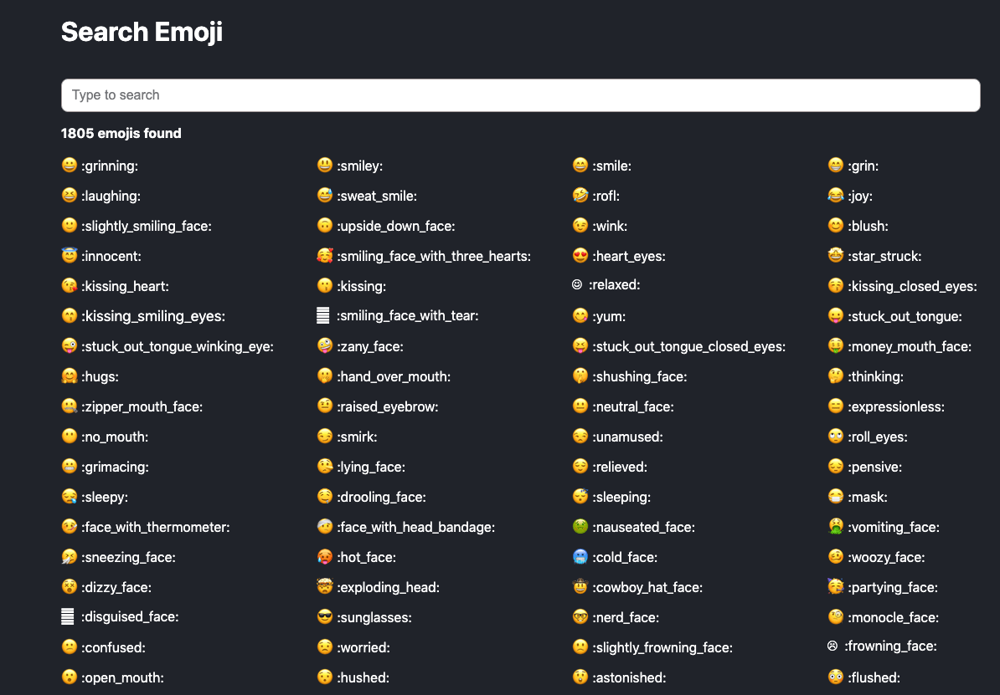

# Webpack Training

A webpack training repository

## Problem statement

I have a web application stored on Github (on this repository), built using `React`, `less` pre-processor.

Help me to create a webpack configuration for development (of course including HMR) and production.

## Clues

- Fork or copy the repo to your own Github repo
- Entry `index.html` is on `public` folder.
- In `index.html`, there is variable `%PUBLIC_URL%` that need to be passed in build process
- All file in `public` folder such as `favicon.ico`, `manifest.json`, etc should be place on root directory
- Stylesheet using `.less` so you need to add some webpack loader for this
- You might need a `babel` to traspile some modern code
- All files should be minified in production mode
- All stylesheets need to be extracted from JavaScript
- Development on `localhost:8080/` including HMR
- Production on Github Pages, e.g: `https://mazipan.github.io/webpack-training/`

## Live Apps

[https://mlltv.csb.app/](https://mlltv.csb.app/)

## Credits

- React
- Codesandbox
- [Gemoji by Github](https://github.com/github/gemoji)

---

By Irfan Maulana in 2020
